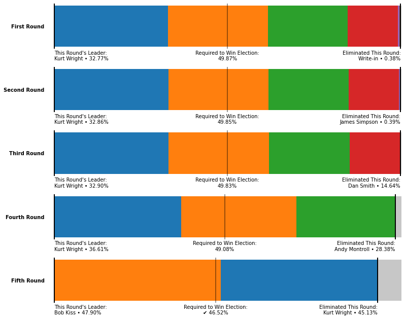
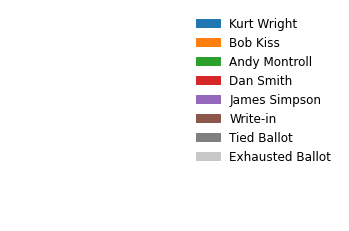

# Results for _Burlington 2009 Mayoral Election_

A demonstration of [Nyquist's Ranked Choice Voting Tabulator](https://github.com/KalebNyquist/ranked-choice-tabulator) on results from [Burlington's 2009 Mayoral Election](https://en.wikipedia.org/wiki/2009_Burlington_mayoral_election). Note that all paragraph-length text in the outputs below is automatically generated entirely by the tabulator.

## Inputs

### Data Source

https://drive.google.com/drive/folders/1oJ0Et8N280O6Vbx9nCS5nlU1b5mcGi9K

### Read Configuration

> ```json
> {'File Name': 'Burlington Mayor 2009/*.PRM',
>  'Record Structure': 'array',
>  'File Delimiter': ' ',
>  'Header Row': None,
>  'Unique Record ID': 0,
>  'Tied Symbol': '=',
>  'Array Column': '1',
>  'Array Delimiter': ',',
>  'Array Template': '{candidate}[{rank}]',
>  'Configuration Nickname': 'Burlington Mayor 2009'}
> ```

## Outputs

Bob Kiss won the election after 5 instant run-off rounds.

### Visualization





### Narrative Results

In the first round of voting, Kurt Wright received the most highest rankings of any candidate with 2,946 votes. Bob Kiss was second with 2,585 votes, Andy Montroll was third with 2,062 votes, Dan Smith was fourth with 1,305 votes, and James Simpson was fifth with 35 votes. Because Write-in received the fewest highest rankings with only 34 votes, they do not advance to the next round. Of Write-in's 34 votes, 8 votes are transferred to Kurt Wright, 7 votes are transferred to Bob Kiss, 12 votes are transferred to Andy Montroll, and 2 votes are transferred to Dan Smith. 9 ballots did not rank any of the remaining candidates andare removed from consideration. Because no candidate reached the 4,484 vote threshold to win the election, voting continues on to the second round.

In the second round of voting, Kurt Wright held first place with 2,954 votes. Bob Kiss remained at second with 2,592 votes, Andy Montroll remained at third with 2,074 votes, and Dan Smith remained at fourth with 1,307 votes. Because James Simpson received the fewest highest rankings with only 35 votes, they do not advance to the next round. Of James Simpson's 35 votes, 4 votes are transferred to Kurt Wright, 14 votes are transferred to Bob Kiss, 4 votes are transferred to Andy Montroll, and 9 votes are transferred to Dan Smith. 4 ballots did not rank any of the remaining candidates andare removed from consideration. Because no candidate reached the 4,482 vote threshold to win the election, voting continues on to the third round.

In the third round of voting, Kurt Wright held first place with 2,958 votes. Bob Kiss remained at second with 2,606 votes, and Andy Montroll remained at third with 2,078 votes. Because Dan Smith received the fewest highest rankings with only 1,316 votes, they do not advance to the next round. Of Dan Smith's 1,316 votes, 334 votes are transferred to Kurt Wright, 375 votes are transferred to Bob Kiss, and 474 votes are transferred to Andy Montroll. 133 ballots did not rank any of the remaining candidates andare removed from consideration. Because no candidate reached the 4,480 vote threshold to win the election, voting continues on to the fourth round.

In the fourth round of voting, Kurt Wright held first place with 3,292 votes. Bob Kiss remained at second with 2,981 votes. Because Andy Montroll received the fewest highest rankings with only 2,552 votes, they do not advance to the next round. Of Andy Montroll's 2,552 votes, 1,326 votes are transferred to Bob Kiss, and 766 votes are transferred to Kurt Wright. 460 ballots did not rank any of the remaining candidates andare removed from consideration. Because no candidate reached the 4,413 vote threshold to win the election, voting continues on to the fifth round.

In the fifth round of voting, Bob Kiss won the election with 4,307 votes, 124 votes more than the 4,183 vote threshold required to win. Kurt Wright fell to second with 4,058 votes. 


### Monotonicity Check

In this election, Bob Kiss was elected the winner in the fifth round. However, there exists a range of non-monotonicity where Andy Montroll will paradoxically win the election if Bob Kiss receives additional votes in the form of higher rankings.¹

Before we start moving votes around, note that Andy Montroll only needs 429 votes to beat Bob Kiss, and if Kurt Wright is eliminated before Andy Montroll that will give Andy Montroll an additional 1016 votes over Bob Kiss. Only 740 votes separate Kurt Wright from Andy Montroll, and every additional vote for Bob Kiss over Kurt Wright decreases this gap.

Non-monotonicity begins when, of the 3295 voters who prefer Kurt Wright over Bob Kiss & Andy Montroll, at minimum:

- 495 of the 495 voters who **prefer Bob Kiss over Andy Montroll** defect, and place Bob Kiss above Kurt Wright 
- 245 of the 1289 voters who **equally rank Bob Kiss and Andy Montroll** defect and place Bob Kiss above Kurt Wright and Andy Montroll
- 0 of the 1511 voters who **prefer Andy Montroll over Bob Kiss** defect and place Bob Kiss above Kurt Wright and Andy Montroll

In this range of non-monotonicity Andy Montroll will win the election instead of Bob Kiss despite not receiving any more votes due to Kurt Wright having an earlier elimination.

Non-monotonicity ends when, of the 3295 voters who prefer Kurt Wright over Bob Kiss & Andy Montroll, at maximum:
- 495 of the 495 voters who **prefer Bob Kiss over Andy Montroll** defect, and place Bob Kiss above Kurt Wright 
- 587 of the 1289 voters who **equally rank Bob Kiss and Andy Montroll** defect and place Bob Kiss above Kurt Wright and Andy Montroll
- 0 of the 1511 voters who **prefer Andy Montroll over Bob Kiss** defect and place Bob Kiss above Kurt Wright and Andy Montroll

At this point, Bob Kiss will still be elected winner when receiving more votes.

¹: For simplicity, non-competitive minor candidates have been factored out.
